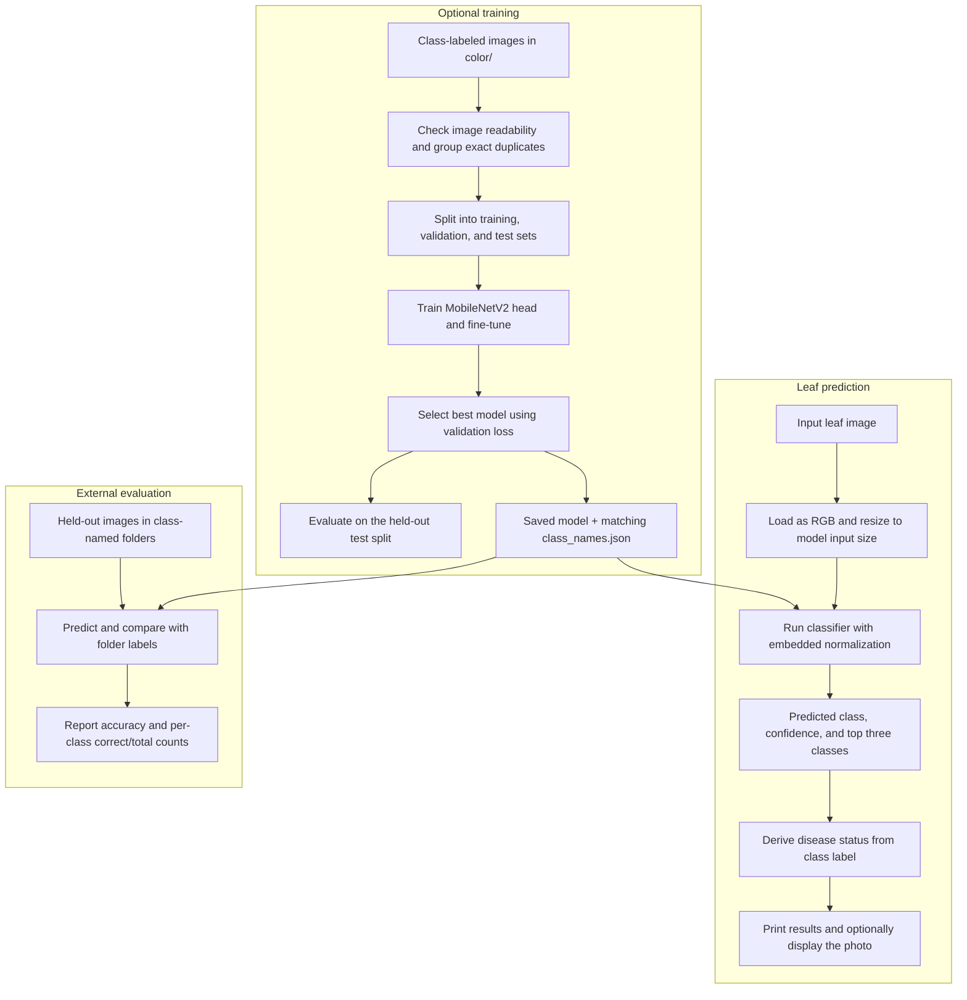
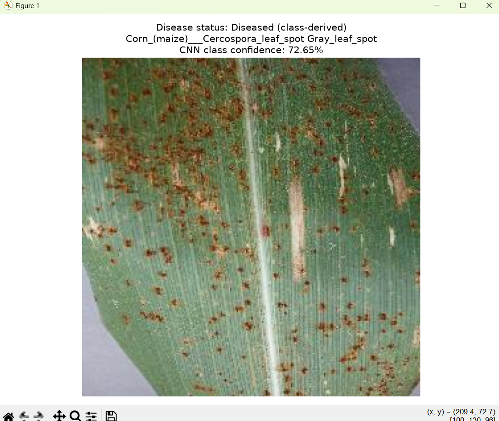
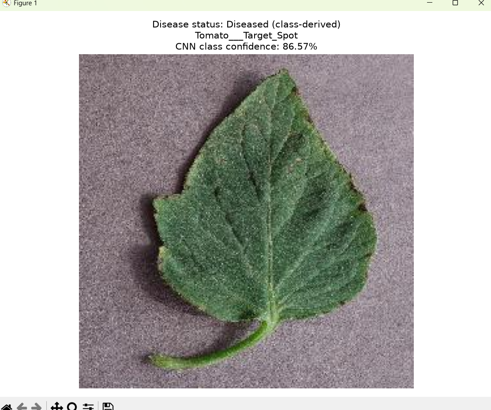
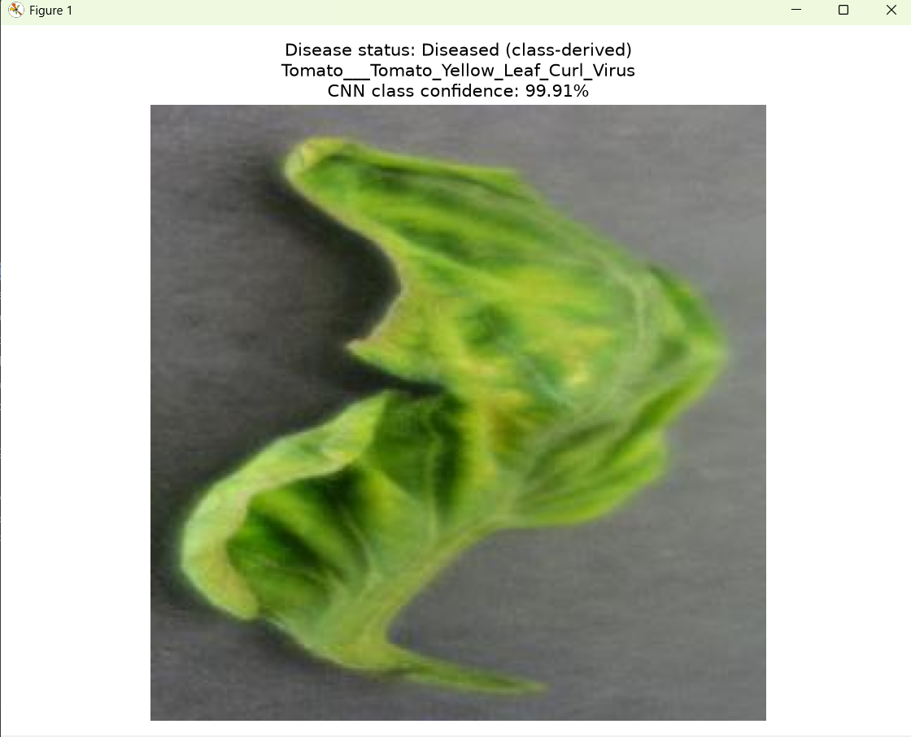

# LeafLens

LeafLens classifies plant leaf images with TensorFlow/Keras and displays a disease status derived from the predicted class. The current workflow uses the saved classifier directly; Ollama is not required.

## Workflow

Prediction uses the existing saved model. Training is optional and produces a new model with matching labels.



## Setup

Run commands from the project folder in PowerShell. If the existing environment works, activate it.

```powershell
cd D:\LeafLens
# Only create the environment if it does not already exist:
py -3.12 -m venv .venv312
.\.venv312\Scripts\Activate.ps1
python -m pip install -r requirements.txt
```

Keep each saved model together with its matching `class_names.json`. Label order must match the model outputs. The root model is the default; training writes models into separate run folders.

## Predict a leaf image

```powershell
python predict_leaf.py "check/apple_exp_pic.jpg"
python predict_leaf.py "check/tomato_test_leaf.jpg" --no-show-image
```

The terminal prints the predicted class, class-derived health status, confidence, and top three predictions. By default, a photo window shows:

```text
Disease status: <status> (class-derived)
<predicted class>
CNN class confidence: <score>
```

Close the photo window to finish the command.

| Argument | Purpose |
| --- | --- |
| `image` | Required image path |
| `--model` | Model path; defaults to the project's `leaflens_model.keras` |
| `--no-show-image` | Print results without opening the photo window |
| `--cnn-only` | Compatibility option; predictions always use only the classifier |

The predictor reads the model's input dimensions, resizes using bilinear interpolation, and loads the labels beside the model. Normalization is embedded in the model.

A class ending in `___healthy` maps to `Not diseased`; other nonempty conditions after `___` map to `Diseased`, including pest damage. Missing or empty conditions map to `Uncertain`. This status is inferred from the class, not a separate visual assessment or binary disease model.

## Example predictions

The following supplied test screenshots show the model's predicted labels and confidence scores. All three display a class-derived disease status of **Diseased**. These are individual examples, not a measurement of test-set accuracy.

### Corn: Cercospora leaf spot / gray leaf spot



Predicted class: `Corn_(maize)___Cercospora_leaf_spot Gray_leaf_spot`. CNN class confidence: **72.65%**.

### Tomato: target spot



Predicted class: `Tomato___Target_Spot`. CNN class confidence: **86.57%**.

### Tomato: yellow leaf curl virus



Predicted class: `Tomato___Tomato_Yellow_Leaf_Curl_Virus`. CNN class confidence: **99.91%**.

## Dataset inspection and training

The default dataset is `color/` beside the scripts. Organize images into class folders:

```text
color/
  Apple___healthy/
    image1.jpg
  Apple___Apple_scab/
    image2.jpg
```

Training scans all class folders recursively for JPG, JPEG, PNG, BMP, and GIF images. It checks decoding, rejects identical files with conflicting labels, and keeps byte-identical images in the same split. Near duplicates are not detected. Each class needs at least three distinct image groups.

```powershell
# Inspect images and save labels and a split manifest without training:
python train_plant_disease.py --inspect-only

# Train into a new output folder:
python train_plant_disease.py --output training_runs/my_new_run

# Use a smaller batch if needed:
python train_plant_disease.py --output training_runs/my_small_batch_run --batch-size 16
```

Use a new output folder for every run; existing output folders are rejected. Without `--output`, a timestamped folder is created under `training_runs/`. Use `--dataset PATH` for another dataset.

The script creates reproducible per-class splits of approximately 70% training, 15% validation, and 15% test, based on distinct image groups. Duplicate group sizes can change the image proportions. The default seed is 123.

New training uses ImageNet-pretrained MobileNetV2 with 224 x 224 RGB inputs, augmentation, dropout, class weights, early stopping, learning-rate reduction, and best-validation-loss checkpoints. The first run may download pretrained weights.

Training first fits the classification head for up to 20 epochs, then fine-tunes the last 30 backbone layers, excluding batch-normalization layers, for up to 10 epochs. Override these limits with `--epochs` and `--fine-tune-epochs`; set the latter to 0 to skip fine-tuning. The default batch size is 32. CPU training can take substantial time.

Run artifacts:

| File | Contents |
| --- | --- |
| `class_names.json` | Ordered labels saved automatically |
| `split_manifest.json` | Dataset location, seed, split membership, and per-class counts |
| `leaflens_model.keras` | Best model selected by validation loss |
| `head_history.json` | Head-training metrics by epoch |
| `fine_tune_history.json` | Fine-tuning metrics, when enabled |
| `test_metrics.json` | Test loss and accuracy, confusion matrix, and per-class recall |
| `training_config.json` | Architecture and training settings |

Inspection-only runs save labels and the split manifest. Other artifacts are produced as training completes. Test evaluation occurs after validation-based model selection.

Use a newly trained model explicitly:

```powershell
python predict_leaf.py "check/apple_exp_pic.jpg" --model training_runs/my_new_run/leaflens_model.keras
```

Training does not overwrite the root model. Do not regenerate labels independently for an existing model.

## Evaluate labeled images

Use images excluded from training and model selection, organized into subfolders named exactly like the model's classes.

```powershell
python evaluate_leaf.py "D:\held-out-leaves"
python evaluate_leaf.py "D:\held-out-leaves" --model training_runs/my_new_run/leaflens_model.keras
python evaluate_leaf.py "D:\held-out-leaves" --limit 100 --seed 123
```

The evaluator supports JPG, JPEG, PNG, BMP, and GIF images and rejects unknown class folders. It prints progress to stderr and a JSON report to stdout containing the number of images, `cnn_accuracy`, and per-class correct/total counts. `--limit` takes a reproducible random sample.

The evaluator does not check for overlap with training data. Accuracy describes only the supplied images; a class confidence score is not an accuracy measurement or a calibrated guarantee of correctness. Same-source test results do not establish performance on field photographs.

## Tests

```powershell
python -B -m unittest test_pipeline test_training -v
```

The tests cover health-label mapping, terminal prediction without network calls, deterministic splits, duplicate grouping, complete/disjoint image assignment, and rejection of classes with too few groups. They verify software behavior, not classification quality.

## Project files

| File or folder | Role |
| --- | --- |
| `predict_leaf.py` | Saved-model inference and photo display |
| `evaluate_leaf.py` | Evaluation against class-folder labels |
| `train_plant_disease.py` | Dataset inspection, splitting, MobileNetV2 training, and test metrics |
| `dataset_config.py` | Default dataset location |
| `test_pipeline.py`, `test_training.py` | Regression tests |
| `leaflens_model.keras`, `class_names.json` | Default model and matching labels |
| `requirements.txt` | Pinned Python dependencies |
| `.gitignore` | Git exclusions |
| `color/` | Local training dataset |
| `check/` | Sample images for manual predictions |
| `training_runs/` | Local training and inspection artifacts |
| `.venv312/` | Local Python environment |

The obsolete Ollama integration, standalone OpenCV experiment, old dataset checker/reports, and standalone label-generation script have been removed. Dataset inspection and label generation are handled by `train_plant_disease.py`.

## Troubleshooting

- Include a quoted image path after `predict_leaf.py`.
- For missing image-loading dependencies, install `requirements.txt` in the active environment.
- For missing or mismatched labels, restore the label file belonging to that model.
- For an existing training output folder, choose a new `--output` path.
- Use `--no-show-image` when a graphical display is unavailable.

## Disclaimer

LeafLens is intended for educational and research purposes. Its predictions are not a confirmed plant disease diagnosis or a substitute for assessment by a qualified agricultural professional or plant pathologist.

The displayed disease status is derived from the predicted class. Confidence is the model's score for that class; it does not establish diagnostic certainty or overall accuracy. A high-confidence prediction can be incorrect, and a "Not diseased" result does not guarantee that a plant is healthy. Performance may vary with plant species, image quality, lighting, backgrounds, and growing conditions.

The example screenshots illustrate model outputs only; they do not establish independently verified diagnoses or performance on unseen data. Seek professional advice before making treatment or crop-management decisions based on these results.

## Author

Prokash - [prokashghosh996-png](https://github.com/prokashghosh996-png)

Project repository: [LeafLens](https://github.com/prokashghosh996-png/LeafLens)
