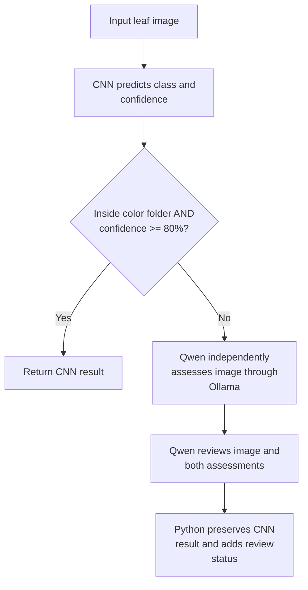

# LeafLens

Plant leaf classification with a TensorFlow CNN and conditional Ollama vision review.

## Overview

LeafLens is an educational machine-learning project that predicts plant-and-disease classes from leaf images. A custom CNN provides the prediction and confidence, while `qwen3-vl:2b`, running locally through Ollama, provides an additional assessment when required.

Python preserves the CNN's original class and score. Ollama adds advisory observations and review status; it does not replace the classifier's output.

## Demo / Example Prediction

Run a prediction with a real image path:

```powershell
python predict_leaf.py "D:\LeafLens\check\images.jpg"
```

Example output from the healthy apple image discussed during development:

```text
Final result: Apple___healthy (dataset cnn only)
Assessment confidence: 83.36%
```

This is confidence for one image, not a dataset accuracy measurement. Results vary by image and saved model.

## Problem Statement

Leaf images can contain similar colors, textures, and symptoms across different plant classes. A classifier may produce a plausible label while remaining uncertain. LeafLens explores image classification alongside a second visual assessment that flags uncertainty and disagreement without silently changing the original prediction.

## Key Features

- Custom TensorFlow/Keras CNN for plant-and-disease classification.
- Confidence-based review routing with an adjustable 80% default threshold.
- Independent Qwen image assessment followed by a review of both outputs.
- Code-enforced preservation of the CNN class and confidence.
- Structured Ollama responses with field validation and failure handling.
- Dataset inspection scripts, labeled-image evaluation, and regression tests.
- Compact command-line output showing the final result and confidence.

## How LeafLens Works

1. Load `leaflens_model.keras` and the ordered labels in `class_names.json`.
2. Resize the input to 128 x 128 RGB pixels and run the CNN.
3. Skip Ollama only when the image is inside the configured dataset folder and confidence meets the threshold.
4. Otherwise, ask Qwen to assess the image without seeing the CNN prediction.
5. Ask Qwen again to review the image and both assessments.
6. Preserve the CNN class and confidence and attach a review status.

| Image location | CNN confidence | Processing |
| --- | --- | --- |
| Inside the configured `color` folder | At least 80% | CNN only |
| Inside the configured `color` folder | Below 80% | CNN plus Ollama assessment and review |
| Outside the configured folder | Any score | CNN plus Ollama assessment and review |

`--min-confidence` changes the threshold. `--cnn-only` explicitly skips Ollama for any image. Low confidence remains flagged even when Ollama supports the prediction.

## Architecture / Pipeline



This shows the normal successful flow. If the first Ollama call fails, the second is skipped; the CNN result remains available with a review flag.

## Dataset

The project uses a local `color` dataset organized into plant-and-disease class folders. Earlier source paths identify it as a PlantVillage dataset directory; no dataset download or provenance manifest is maintained in this repository.

```text
color/
  Apple___healthy/
    image1.jpg
  Apple___Apple_scab/
    image2.jpg
  Grape___healthy/
    image3.jpg
```

`dataset_config.py` points to the `color` folder beside the scripts. Folder names supply labels. `dataset_counts.json` and `image_readability_report.json` contain results from previous inspections and may need regeneration.

Training uses an 80/20 training/validation split with seed 123. The script does not create a separate test split. Prepare independent test images before claiming performance on unseen data.

## Data Preparation

1. Inspect class counts and image readability using `dataset_check.py`, after checking its hard-coded paths.
2. Confirm that training and `save_class_names.py` point to the same class folders.
3. Generate labels in alphabetical order, matching the training loader.
4. Load images as 128 x 128 RGB batches of 32 for training.
5. Scale pixels by 1/255 inside the model.

```powershell
python save_class_names.py
```

This overwrites `class_names.json`. Keep the saved model and matching label order together; regenerating labels from a different set of folders can mislabel predictions.

Prediction uses bilinear resizing and does not normalize pixels again. The separate `level1.py` experiment uses OpenCV with 224 x 224 images and is not part of current inference.

The readability-report saving lines in `dataset_check.py` are currently commented out. Inspect its configuration before treating its existing report as current.

## Model Architecture

The implemented model is a CNN trained from scratch:

```text
Input: 128 x 128 x 3
  -> Rescaling (1/255)
  -> Conv2D (16 filters, 3x3, ReLU) -> MaxPooling2D
  -> Conv2D (32 filters, 3x3, ReLU) -> MaxPooling2D
  -> Conv2D (64 filters, 3x3, ReLU) -> MaxPooling2D
  -> GlobalAveragePooling2D
  -> Dense (64 units, ReLU)
  -> Dense (number of classes, softmax)
```

Convolution layers learn visual features, pooling reduces spatial dimensions, and dense layers produce class scores. Training uses Adam, sparse categorical cross-entropy, accuracy tracking, and 10 epochs.

```powershell
python train_plant_disease.py
```

Run from the project directory. Training overwrites `leaflens_model.keras`. The current script does not implement transfer learning, MobileNetV2, fine-tuning, augmentation, or early stopping.

## Experiments

The repository contains the following development work:

| Experiment or check | Evidence and scope |
| --- | --- |
| Image preprocessing | `level1.py` explores color conversion, resizing, and scaling. |
| Dataset inspection | `dataset_check.py` counts images and attempts to decode them. |
| Custom CNN baseline | `train_plant_disease.py` defines a 10-epoch training run. |
| Original versus integrated inference | Both prediction paths produced 65.475541% grape-healthy confidence for the same checked grape image and saved model. |
| Conditional Ollama review | Routing uses dataset location and confidence; tests cover the 80% boundary. |

No recorded comparison of multiple training architectures or cross-dataset benchmark is included. Transfer-learning experiments remain future work in the current implementation.

## Results

Observed examples during development:

| Image example | CNN prediction | Confidence | Evidence |
| --- | --- | --- | --- |
| Healthy apple, `RS_HL 5759.JPG` | `Apple___healthy` | 83.36% | Reported CLI output |
| Healthy grape, `Mt.N.V_HL 9127.JPG` | `Grape___healthy` | 65.48% | Reproduced with original and current prediction logic |

Latest user-reported CLI results (paths relative to the project root):

| Input image | Expected label / context | CNN prediction | Confidence | Reported status |
| --- | --- | --- | --- | --- |
| `color/Apple___healthy/0a553fc0-fc2c-4598-baba-3bc10191447c___RS_HL 5969.JPG` | `Apple___healthy` (folder label) | `Apple___healthy` | 97.59% | `dataset cnn only` |
| `check/apple_exp_pic.jpg` | Apple suggested by filename; ground truth unverified | `Orange___Haunglongbing_(Citrus_greening)` | 90.93% | `needs review` |
| `check/tomato_test_leaf.jpg` | Tomato suggested by filename; ground truth unverified | `Blueberry___healthy` | 99.99% | `needs review` |
| `color/Potato___healthy/a4d1d8cb-26a2-413f-a229-021e2eea87ac___RS_HL 1819.JPG` | `Potato___healthy` (folder label) | `Soybean___healthy` | 52.36% | `needs review` |
| `color/Cherry_(including_sour)___healthy/0b7b9ff9-4324-4ee0-a77c-6bf4b9331c6d___JR_HL 4110.JPG` | `Cherry_(including_sour)___healthy` (folder label) | `Cherry_(including_sour)___healthy` | 57.69% | `needs review` |
| `color/Cherry_(including_sour)___healthy/1bdfdc8f-3ac6-497f-9dc3-58c7803a0ac8___JR_HL 9887 copy.JPG` | `Cherry_(including_sour)___healthy` (folder label) | `Cherry_(including_sour)___healthy` | 94.34% | `dataset cnn only` |
| `color/Blueberry___healthy/0af69fdc-fc5f-44ac-bb75-0939611516f6___RS_HL 0323.JPG` | `Blueberry___healthy` (folder label) | `Blueberry___healthy` | 99.71% | `dataset cnn only` |

Cherry class names above use the canonical spelling; formatting artifacts in the pasted terminal transcript have been normalized.

These runs illustrate several different outcomes:

- Apple, both cherry examples, and blueberry match their dataset folder labels. The potato image is misclassified relative to its folder label.
- The 57.69% cherry result matches its label but still requires review because confidence is below 80%. Low confidence does not necessarily mean an incorrect prediction.
- The external apple- and tomato-named images receive different plant predictions despite high confidence. If their filenames correctly identify their contents, these are high-confidence classification errors; the transcript alone does not verify their ground truth.
- Images outside `color` enter the Ollama flow regardless of confidence. A `needs review` status at 90.93% or 99.99% can reflect disagreement, uncertainty, or an Ollama failure. These logs do not show which reason occurred or prove that both Ollama calls completed.
- Ollama does not overwrite the displayed CNN label or confidence.

These selected examples do not establish dataset-wide accuracy. The earlier grape example also assigned approximately 30.87% to `Soybean___healthy`, illustrating class confusion.

Ten regression tests passed during development. They verify software behavior, not classification quality.

**Confidence** is the CNN's softmax score for one predicted class. It is not a calibrated guarantee that the prediction is correct.

**Accuracy** is the fraction of correctly classified labeled images:

```text
accuracy = correct predictions / total evaluated images
```

Evaluate on images excluded from training and model selection, with class-named subfolders:

```powershell
python evaluate_leaf.py "D:\held-out-leaves"
python evaluate_leaf.py "D:\held-out-leaves" --with-ollama --limit 100
```

The optional sample uses a fixed seed by default. Reports include CNN accuracy and per-class counts. With Ollama enabled, they also include vision-result availability and agreement metrics. Normal routing still applies.

Final-label accuracy equals CNN accuracy because Ollama cannot change the final label. Two calls to the same Qwen model do not constitute an independent accuracy test, and agreement does not prove correctness. The repository does not establish a held-out accuracy figure for the saved model.

Current evaluation limitation: `needs_review` is calculated as all images minus those with `models_agree`; this also counts intentionally skipped dataset images. Use a separate held-out folder for evaluation and interpret that field accordingly. Vision accuracy over all images also includes images without a vision result in its denominator.

## Real-World Generalization

Performance on the local dataset does not establish performance on field photographs. Different lighting, backgrounds, cameras, leaf positions, and symptom appearances can create domain shift.

The two external images in the Results table are preliminary checks, not a cross-dataset benchmark. Their predictions conflict with the plant names suggested by their filenames even at 90.93% and 99.99% confidence. This motivates checking ground truth and investigating generalization; it does not establish domain shift as the cause.

Cross-dataset evaluation and evaluation on independently labeled field images have not been documented for the saved model. A useful next evaluation would keep those images separate from training and model selection, then report overall and per-class performance.

Two calls to the same Qwen model are not independent confirmation of correctness. A high softmax score or agreement between models does not guarantee a correct diagnosis.

## Project Structure

| File | What it does | Main tools |
| --- | --- | --- |
| `predict_leaf.py` | Loads the CNN, predicts the top classes, routes review, and prints the final result | TensorFlow/Keras, argparse, pathlib, JSON |
| `test_ollama.py` | Sends images to local Qwen for assessment and review; validates structured responses | urllib.request, base64, JSON |
| `dataset_config.py` | Shares the dataset path and checks directory membership | pathlib |
| `train_plant_disease.py` | Builds and trains the CNN, then saves its weights and architecture | TensorFlow/Keras, Matplotlib |
| `save_class_names.py` | Saves alphabetically ordered class folder names | pathlib, JSON |
| `evaluate_leaf.py` | Compares predictions with folder labels and reports accuracy | Prediction module, argparse, random, JSON |
| `test_pipeline.py` | Tests routing, response validation, failures, and override protection | unittest, unittest.mock |
| `dataset_check.py` | Counts images by class and checks image readability | OpenCV, pathlib, JSON |
| `level1.py` | Demonstrates loading, color conversion, resizing, and scaling | OpenCV |

Despite its name, `test_ollama.py` is the integration module. Automated regression tests are in `test_pipeline.py`.

Supporting files:

- `dataset_counts.json`: image counts per class from a previous dataset inspection.
- `image_readability_report.json`: results from a previous readability check.
- `requirements.txt`: Python dependency versions.
- `.gitignore`: files Git should ignore; it does not affect prediction.

## Installation

Run commands from the project directory. If your existing `.venv312` environment is working, activate it and keep using it.

```powershell
cd D:\LeafLens
# Create the environment only if it does not already exist:
py -3.12 -m venv .venv312
.\.venv312\Scripts\Activate.ps1
python -m pip install -r requirements.txt
```

The requirements file contains pinned dependencies; installation depends on those versions being available for your Python/platform. The optional OpenCV scripts (`level1.py` and `dataset_check.py`) additionally need:

```powershell
python -m pip install opencv-python
```

Keep these files beside `predict_leaf.py`:

- `leaflens_model.keras`: saved CNN model.
- `class_names.json`: labels in exactly the output order used during training.

For the review flow, install and start Ollama, then download the configured model:

```powershell
ollama pull qwen3-vl:2b
```

If the local server is not already running, start it in another terminal:

```powershell
ollama serve
```

The code connects to `http://localhost:11434/api/chat` using Python's standard-library HTTP client. It does not require the Ollama Python package.

## Usage / Running Predictions

```powershell
python predict_leaf.py "D:\LeafLens\check\images.jpg"
```

Example output format (the score depends on the image and model):

```text
Final result: Apple___healthy (dataset cnn only)
Assessment confidence: 83.36%
```

| Option | Default | Purpose |
| --- | --- | --- |
| `image` | Required | Path to an image file |
| `--min-confidence` | `0.8` | Threshold used for routing and review flags |
| `--ollama-model` | `qwen3-vl:2b` | Installed vision model to use |
| `--timeout` | `120` | Timeout in seconds for network operations in each Ollama request |
| `--dataset-path` | Project's `color` folder | Override the dataset folder for prediction |
| `--cnn-only` | Off | Skip both Ollama calls |

```powershell
python predict_leaf.py "D:\LeafLens\check\images.jpg" --cnn-only
python predict_leaf.py "D:\LeafLens\check\images.jpg" --timeout 240
python predict_leaf.py "D:\LeafLens\check\images.jpg" --min-confidence 0.85
```

Each Ollama call has its own timeout; it is not a strict total deadline for the whole pipeline. A timeout or invalid response preserves the CNN result and flags it for review. If the first assessment fails, the second review is skipped.

Output statuses:

- `dataset cnn only`: dataset image met the confidence threshold, so Ollama was skipped.
- `models agree`: the assessments agree, the review supports the CNN, and confidence meets the threshold.
- `needs review`: low confidence, disagreement, uncertainty, or an Ollama error occurred.
- `CNN only; not reviewed`: the explicit `--cnn-only` option was used.

Low-confidence predictions remain flagged even when Ollama supports them. The compact CLI output omits the detailed observations and error messages, which remain available in the dictionary returned by `analyze_leaf()`.

To run the independent Ollama assessment alone:

```powershell
python test_ollama.py "D:\LeafLens\check\images.jpg"
```

### Run the Tests

```powershell
python -B -m unittest test_pipeline -v
```

The tests mock inference and Ollama responses. They check the 80% boundary, dataset routing, unchanged CNN class/confidence, disagreement handling, unavailable Ollama, and invalid response fields. They test program behavior, not model accuracy.

### Troubleshooting

- **Missing `image` argument:** include a quoted image path after `predict_leaf.py`.
- **`Could not import PIL.Image`:** install Pillow in the active environment with `python -m pip install --upgrade Pillow`.
- **Ollama unavailable:** check that its server is running and `qwen3-vl:2b` is installed. Use `--timeout 240` if requests need longer.
- **Unexpected dataset routing:** check `dataset_config.py` or pass `--dataset-path`. Dataset images below the threshold intentionally use Ollama.
- **oneDNN startup messages:** these can still appear even though the script attempts to reduce TensorFlow logging; inspect any subsequent traceback to identify an actual failure.

## Technology Stack

| Tool | Role |
| --- | --- |
| Python | Training, inference, data inspection, and CLI coordination |
| TensorFlow / Keras | Image data pipelines, CNN training, and saved-model inference |
| Pillow | Image loading through Keras |
| OpenCV | Standalone preprocessing and dataset inspection |
| Matplotlib | Training-script sample-image visualization |
| Ollama + Qwen3-VL 2B | Local vision assessment and review |
| pathlib, argparse, JSON, base64, urllib.request | Paths, CLI inputs, structured data, and HTTP communication |
| unittest / unittest.mock | Regression tests without live model calls |

Pandas and Seaborn are present in the training imports but are currently unused.

## Limitations

- The final class and confidence are locked to the CNN; review cannot directly improve final-label accuracy.
- Softmax confidence is not calibrated accuracy. The default 80% threshold is a heuristic.
- Dataset routing checks location, not image identity or actual membership in the training split.
- No independent held-out or cross-dataset accuracy is established for the saved model.
- The current training script lacks augmentation, imbalance handling, early stopping, and a separate test split.
- Ollama review adds latency and can fail, disagree, or produce incorrect observations.
- Compact CLI output omits detailed review reasons and errors; `analyze_leaf()` retains them in its returned dictionary.
- Evaluation's `needs_review` count includes intentionally skipped dataset images because it counts all images without `models_agree`. Vision accuracy over all images includes those without a vision result in its denominator.
- Some utility scripts use hard-coded paths, and stored dataset inspection reports can be stale.

## Future Improvements

- Compare the custom CNN with MobileNetV2 transfer learning and fine-tuning.
- Add realistic augmentation and investigate class imbalance.
- Track training curves, monitor overfitting, and use early stopping and best-model checkpoints.
- Record reproducible train/validation/test manifests and check for duplicate leakage.
- Report confusion matrices and per-class precision, recall, and F1 scores.
- Evaluate on a second dataset and real field photographs.
- Calibrate confidence and select the review threshold using validation results.
- Refine evaluation reporting for intentionally skipped Ollama calls.
- Centralize utility-script paths and automate dataset integrity reports.

## What I Learned

Building LeafLens helped me learn and explore the following topics:

- Image preprocessing
- Dataset inspection
- Dataset integrity checking
- TensorFlow data pipelines
- CNN fundamentals
- Transfer learning
- MobileNetV2
- Fine-tuning
- Model evaluation
- Train/validation/test splits
- Class imbalance
- Overfitting
- Early stopping
- Domain shift
- Cross-dataset evaluation
- Real-world model generalization
- ML experimentation
- Model inference

## Disclaimer

LeafLens is an educational/research project and should not be treated as a substitute for professional agricultural or plant pathology diagnosis.

## Author

Prokash — [prokashghosh996-png](https://github.com/prokashghosh996-png)

Project repository: [LeafLens](https://github.com/prokashghosh996-png/LeafLens)
